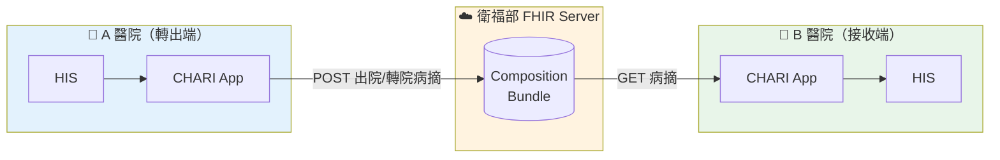
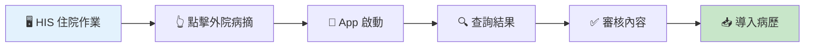
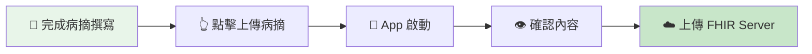
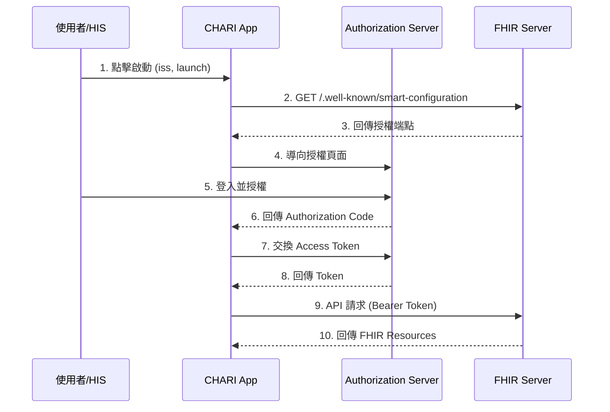

# CHARI：轉院住院病歷整合系統

> **SMART on FHIR App** - 跨院病摘雙向交換平台

[](LICENSE)
[](https://hl7.org/fhir/R4/)
[](https://thas.mohw.gov.tw/)

---

## 專案簡介

**CHARI** (Cross-Hospital Admission Record Integration) 是一個 SMART on FHIR App，用於解決跨院轉診時的病歷整合問題。讓接收醫院能快速查閱轉出醫院的病摘，並選擇性導入至本院病歷系統。

### 解決的問題

| 痛點 | 現況 | CHARI 解決方案 |
|------|------|----------------|
| 資料取得困難 | 紙本傳真、PDF 掃描 | FHIR 標準化查詢 |
| 無法直接利用 | 人工逐項抄寫 | 一鍵選擇性導入 |
| 資訊可能遺漏 | 過敏史、用藥未被注意 | 結構化呈現與警示 |

---

## 系統架構



---

## 使用流程

### 接收端（轉入）流程



### 傳送端（轉出）流程



---

## SMART on FHIR Launch 流程



---

## 核心功能

| 模組 | 功能 | FHIR 操作 |
|------|------|-----------|
| **外院病摘查詢** | 依病人 ID 查詢衛福部 FHIR Server | `GET Composition` |
| **病摘內容審核** | 顯示診斷、用藥、過敏等段落 | Parse `Bundle` |
| **住院病歷導入** | 選擇性導入至本院 | `POST Condition/MedicationStatement` |
| **病摘上傳** | 將本院病摘上傳至 FHIR Server | `POST Bundle` |

### 支援的 FHIR Resources

- `Composition` - 出院/轉院病摘
- `Condition` - 診斷
- `MedicationStatement` - 用藥紀錄
- `AllergyIntolerance` - 過敏史
- `Procedure` - 手術/處置
- `CarePlan` - 照護計畫
- `Encounter` - 就醫紀錄

---

## 測試資料

本專案提供 10 筆測試用出院病摘，已上傳至衛福部 THAS 沙盒：

| 病人 | 診斷 | 來源醫院 |
|------|------|----------|
| 王大明 | 急性心肌梗塞 | 臺北榮民總醫院 |
| 李美華 | 腦中風 | 臺北榮民總醫院 |
| 張志強 | 肺炎 | 臺北榮民總醫院 |
| 黃雅琪 | 乳癌術後 | 臺灣大學醫學院附設醫院 |
| 周秀蘭 | 膽囊切除 | 林口長庚紀念醫院 |
| ... | ... | ... |

**查詢範例**：
```bash
# 用身分證查詢病人
curl "https://thas.mohw.gov.tw/v/r4/fhir/Patient?identifier=urn:oid:2.16.886.103|A123456789"

# 查詢病人的出院病摘
curl "https://thas.mohw.gov.tw/v/r4/fhir/Composition?subject=Patient/pt-test-001"
```

---

## 技術規格

| 項目 | 規格 |
|------|------|
| FHIR 版本 | R4 |
| Profile | TW Core IG |
| 認證方式 | OAuth 2.0 (SMART App Launch) |
| 前端框架 | React + fhirclient.js |
| 部署方式 | GitHub Pages |

### 環境設定

| 環境 | URL |
|------|-----|
| FHIR Server | `https://thas.mohw.gov.tw/v/r4/fhir` |
| Patient Browser | `https://thas.mohw.gov.tw/patient-browser/` |
| Launch URL | `https://selika.github.io/CHARI/launch.html` |

---

## 專案結構

```
CHARI/
├── README.md           # 本文件
├── LICENSE             # Apache 2.0
├── launch.html         # SMART Launch 頁面
├── index.html          # 主應用程式
├── css/
│   └── style.css
├── js/
│   ├── app.js          # 主程式邏輯
│   ├── fhir-queries.js # FHIR 查詢
│   └── ui-components.js
└── docs/
    ├── INSTALL.md      # 安裝說明
    └── FHIR_SPEC.md    # FHIR 規格
```

---

## 開源授權

本專案採用 **Apache License 2.0** 授權。

---

## 作者

**蔡世能** - 臺北榮民總醫院 教學部教師培育科 資訊工程師

---

## 參考資料

- [HL7 FHIR R4](https://hl7.org/fhir/R4/)
- [SMART App Launch IG](https://docs.smarthealthit.org/)
- [TW Core IG](https://twcore.mohw.gov.tw/)
- [fhirclient.js](https://docs.smarthealthit.org/client-js/)
- [衛福部 SMART 平台](https://thas.mohw.gov.tw/)
